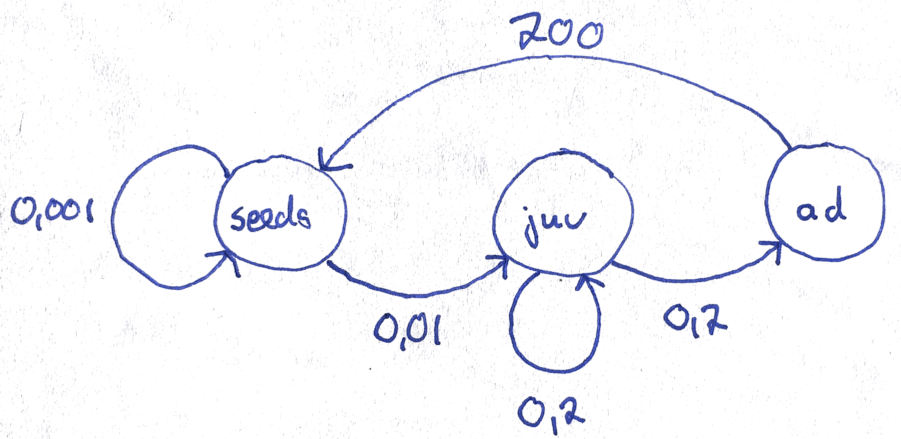

```{r setup, include=FALSE}
knitr::opts_chunk$set(echo = TRUE)
```

# Exercise: Structured populations - Solutions {.tabset}

## Population projection

Note that this exercise consists of two tabs!

Using the example from the lecture, you will in this exercise apply matrix multiplication to project population dynamics for a couple of time steps into the future.

The following code shows how to define a population projection matrix in R. We here use the three-by-three matrix from the lecture.

```{r}
transition.matrix <- matrix(c(0.1,0,100,0.02,0.2,0,0,0.2,0.6), nrow=3, ncol=3, byrow=T)
transition.matrix # let's have a look at the matrix
```

Let us now define the initial population vector at time $t=0$.

```{r}
N.0 <- c(1000, 30, 15)
N.0 # let's have a look at the vector
```

In order to obtain the vector describing the population composition one time step into the future, we multiply the current population vector ```N.0``` from the right to the population projection matrix ```transition.matrix```. The multiplication between a matrix and a vector is executed in R using the symbol ```%*%```.

```{r echo=FALSE}
(N.1 <- transition.matrix %*% N.0) # the parentheses around a command make that the vector N.1 is immediately shown, that is, without explicitly asking for it as was done in the two previous commands.
```

```{r echo=FALSE}
(N.2 <- transition.matrix %*% N.1)
```

Use the this procedure to produce the population vectors for the first ten time steps, ```N.1, N.2,..., N.10```.

```{r}
N.3 <- transition.matrix %*% N.2
N.4 <- transition.matrix %*% N.3
N.5 <- transition.matrix %*% N.4
N.6 <- transition.matrix %*% N.5
N.7 <- transition.matrix %*% N.6
N.8 <- transition.matrix %*% N.7
N.9 <- transition.matrix %*% N.8
N.10 <- transition.matrix %*% N.9
```

You can see the correct results in the following table.

```{r echo=FALSE}
time.series <- as.data.frame(matrix(c(N.0, N.1, N.2, N.3, N.4, N.5, N.6, N.7, N.8, N.9, N.10), ncol=3, byrow=TRUE))
time.series <- data.frame(0:10, time.series)
colnames(time.series) <- c("time", "Seeds", "Juv", "Ad")
time.series
```

Next, let us compute the total number of individuals at time `t=0`, `t=1` until `t=10` using the command ```sum()```.

```{r}
Ntot.0 <- sum(N.0) 
Ntot.1 <- sum(N.1)
Ntot.2 <- sum(N.2)
Ntot.3 <- sum(N.3)
Ntot.4 <- sum(N.4)
Ntot.5 <- sum(N.5)
Ntot.6 <- sum(N.6)
Ntot.7 <- sum(N.7)
Ntot.8 <- sum(N.8)
Ntot.9 <- sum(N.9)
Ntot.10 <- sum(N.10)
```

You can see the correct values in the last column of the following table.

```{r echo=FALSE}
time.series$Ntot <- rowSums(time.series[, 2:4])
time.series
```

```{r echo=FALSE}
# old stuff
Ntot_N01 <- c(Ntot.0, Ntot.1, Ntot.2, Ntot.3, Ntot.4, Ntot.5, Ntot.6, Ntot.7, Ntot.8, Ntot.9, Ntot.10)
```

Now we have everything to create a time series plot. With this we mean a plot with time on the x-axis and ```Ntot``` on the y-axis.

```{r echo=FALSE, eval=FALSE}
plot(x=c(0:2), y=c(Ntot.0, Ntot.1, Ntot.2), type = "b", xlab="Time (years)", ylab="Ntot.t", las=1)
```

```{r}
plot(x=c(0:10), y=c(Ntot.0, Ntot.1, Ntot.2, Ntot.3, Ntot.4, Ntot.5, Ntot.6, Ntot.7, Ntot.8, Ntot.9, Ntot.10), type = "b", xlab="Time (years)", ylab="Ntot.t", las=1)
```

Next, let's have a look at the population composition. How is the total number of individuals distributed over the different life-history states?

```{r echo=FALSE, eval=FALSE}
barplot(cbind(N.0, N.1, N.2), las=1, col=c("grey", "green", "red"), names.arg=c("N.0", "N.1", "N.2"), ylab="Number of individuals", xlab="Time (years)", ylim = c(0, 2000))
legend("topright", bty="n", legend=c("Seeds", "Seedlings", "Adults"), fill=c("grey", "green", "red"), horiz=T)
```

```{r}
barplot(cbind(N.0, N.1, N.2, N.3, N.4, N.5, N.6, N.7, N.8, N.9, N.10), las=1, col=c("grey", "green", "red"), names.arg=c("N.0", "N.1", "N.2", "N.3", "N.4", "N.5", "N.6", "N.7", "N.8", "N.9", "N.10"), ylab="Number of individuals", xlab="Time (years)", ylim = c(0, 3000), cex.names=0.8)

legend("topleft", bty="n", legend=c("Seeds", "Seedlings", "Adults"), fill=c("grey", "green", "red"), horiz=T)
```

It is also common (and informative) to plot the population vectors as relative numbers to show what relative proportion of the population belongs to each life history state. For this we have to divide the number of individuals in each state by the total population size at that time step.

```{r echo=FALSE, eval=FALSE}
barplot(cbind(N.0/Ntot.0, N.1/Ntot.1, N.2/Ntot.2), col=c("grey", "green", "red"), las=1, names=c("N.0", "N.1", "N.2"), ylab="Proportion of individuals", xlab="Time (years)")
legend("bottom", bty="n", legend=c("Seeds", "Seedlings", "Adults"), fill=c("grey", "green", "red"), horiz=F)
```

```{r}
barplot(cbind(N.0/sum(N.0), N.1/sum(N.1), N.2/sum(N.2), N.3/sum(N.3), N.4/sum(N.4), N.5/sum(N.5), N.6/sum(N.6), N.7/sum(N.7), N.8/sum(N.8), N.9/sum(N.9), N.10/sum(N.10))*100, col=c("grey", "green", "red"), las=1, names=c("N.0", "N.1", "N.2", "N.3", "N.4", "N.5", "N.6", "N.7", "N.8", "N.9", "N.10"), ylab="Number of individuals", xlab="Time (years)", cex.names=0.8)
legend("bottom", bty="n", legend=c("Seeds", "Seedlings", "Adults"), fill=c("grey", "green", "red"), horiz=T)
```

Finally, let us calculate the growth factor $\lambda$ at each time step. For this we have to divide the total population size of two consecutive time steps by each other:
$$
\lambda(t) = \frac{N_{\rm tot}(t+1)}{N_{\rm tot}(t)}.
$$

```{r echo=FALSE}
lambda.0 <- Ntot.1/Ntot.0
lambda.1 <- Ntot.2/Ntot.1
lambda.2 <- Ntot.3/Ntot.2
lambda.3 <- Ntot.4/Ntot.3
lambda.4 <- Ntot.5/Ntot.4
lambda.5 <- Ntot.6/Ntot.5
lambda.6 <- Ntot.7/Ntot.6
lambda.7 <- Ntot.8/Ntot.7
lambda.8 <- Ntot.9/Ntot.8
lambda.9 <- Ntot.10/Ntot.9
```

```{r echo=FALSE}
lambda_N01 <- c(lambda.0, lambda.1, lambda.2, lambda.3, lambda.4, lambda.5, lambda.6, lambda.7, lambda.8, lambda.9)
```

You can see the correct values in the last column of the following table.

```{r echo=FALSE}
time.series$lambda <- c(lambda.0, lambda.1, lambda.2, lambda.3, lambda.4, lambda.5, lambda.6, lambda.7, lambda.8, lambda.9, NA)
time.series
```

Let's make a plot that shows how $\lambda$ changes over time.

```{r}
plot(x=c(0:9), y=c(lambda.0, lambda.1, lambda.2, lambda.3, lambda.4, lambda.5, lambda.6, lambda.7, lambda.8, lambda.9), type = "b", xlab="Time (years)", ylab="growth factor lambda", las=1)
```

Let us now repeat the calculations for the two other starting vectors. Note that I here use two other starting vectors than what is stated in the exercise. However, the conslusions are independent of this. First, $N(0)=(1000, 0, 0)$, 

```{r}
N.0 <- matrix(c(1000, 0, 0), nrow=3, ncol=1, byrow=T)
```

```{r echo=FALSE, results="hide"}
(N.1 <- transition.matrix %*% N.0)
(N.2 <- transition.matrix %*% N.1)
(N.3 <- transition.matrix %*% N.2)
(N.4 <- transition.matrix %*% N.3)
(N.5 <- transition.matrix %*% N.4)
(N.6 <- transition.matrix %*% N.5)
(N.7 <- transition.matrix %*% N.6)
(N.8 <- transition.matrix %*% N.7)
(N.9 <- transition.matrix %*% N.8)
(N.10 <- transition.matrix %*% N.9)

(Ntot.0 <- sum(N.0)) 
(Ntot.1 <- sum(N.1))
(Ntot.2 <- sum(N.2))
(Ntot.3 <- sum(N.3))
(Ntot.4 <- sum(N.4)) 
(Ntot.5 <- sum(N.5))
(Ntot.6 <- sum(N.6)) 
(Ntot.7 <- sum(N.7))
(Ntot.8 <- sum(N.8)) 
(Ntot.9 <- sum(N.9))
(Ntot.10 <- sum(N.10))

Ntot_N02 <- c(Ntot.0, Ntot.1, Ntot.2, Ntot.3, Ntot.4, Ntot.5, Ntot.6, Ntot.7, Ntot.8, Ntot.9, Ntot.10)
```

```{r echo=FALSE, results="hide"}
(lambda.0 <- Ntot.1/Ntot.0)
(lambda.1 <- Ntot.2/Ntot.1)
(lambda.2 <- Ntot.3/Ntot.2)
(lambda.3 <- Ntot.4/Ntot.3)
(lambda.4 <- Ntot.5/Ntot.4)
(lambda.5 <- Ntot.6/Ntot.5)
(lambda.6 <- Ntot.7/Ntot.6)
(lambda.7 <- Ntot.8/Ntot.7)
(lambda.8 <- Ntot.9/Ntot.8)
(lambda.9 <- Ntot.10/Ntot.9)

lambda_N02 <- c(lambda.0, lambda.1, lambda.2, lambda.3, lambda.4, lambda.5, lambda.6, lambda.7, lambda.8, lambda.9)
```

and then $N(0)=(0, 30, 0)$.

```{r}
N.0 <- matrix(c(0, 30, 0), nrow=3, ncol=1, byrow=T)
```

```{r echo=FALSE, results="hide"}
(N.1 <- transition.matrix %*% N.0)
(N.2 <- transition.matrix %*% N.1)
(N.3 <- transition.matrix %*% N.2)
(N.4 <- transition.matrix %*% N.3)
(N.5 <- transition.matrix %*% N.4)
(N.6 <- transition.matrix %*% N.5)
(N.7 <- transition.matrix %*% N.6)
(N.8 <- transition.matrix %*% N.7)
(N.9 <- transition.matrix %*% N.8)
(N.10 <- transition.matrix %*% N.9)

(Ntot.0 <- sum(N.0)) 
(Ntot.1 <- sum(N.1))
(Ntot.2 <- sum(N.2))
(Ntot.3 <- sum(N.3))
(Ntot.4 <- sum(N.4)) 
(Ntot.5 <- sum(N.5))
(Ntot.6 <- sum(N.6)) 
(Ntot.7 <- sum(N.7))
(Ntot.8 <- sum(N.8)) 
(Ntot.9 <- sum(N.9))
(Ntot.10 <- sum(N.10))

Ntot_N03 <- c(Ntot.0, Ntot.1, Ntot.2, Ntot.3, Ntot.4, Ntot.5, Ntot.6, Ntot.7, Ntot.8, Ntot.9, Ntot.10)
```

```{r echo=FALSE, results="hide"}
(lambda.0 <- Ntot.1/Ntot.0)
(lambda.1 <- Ntot.2/Ntot.1)
(lambda.2 <- Ntot.3/Ntot.2)
(lambda.3 <- Ntot.4/Ntot.3)
(lambda.4 <- Ntot.5/Ntot.4)
(lambda.5 <- Ntot.6/Ntot.5)
(lambda.6 <- Ntot.7/Ntot.6)
(lambda.7 <- Ntot.8/Ntot.7)
(lambda.8 <- Ntot.9/Ntot.8)
(lambda.9 <- Ntot.10/Ntot.9)

lambda_N03 <- c(lambda.0, lambda.1, lambda.2, lambda.3, lambda.4, lambda.5, lambda.6, lambda.7, lambda.8, lambda.9)
```

```{r echo=FALSE}
plot(0:10, Ntot_N01, type = "b", pch = 0, col="red", ylim=c(0, 3000), xlab = "time", ylab = "Ntot(t)")
lines(0:10, Ntot_N02, type = "b", pch = 1, col="blue")
lines(0:10, Ntot_N03, type = "b", pch = 2, col="orange")
legend("topleft", c("N.0=(1000, 30, 15)", "N.0=(1000, 0, 0)", "N.0=(0, 30, 0)"), col =c("red", "blue", "orange"), pch = c(0, 1, 2)) 
```

```{r echo=FALSE}
plot(0:9, lambda_N01, type = "b", pch = 0, col="red", xlab = "time", ylab = "lambda(t)", ylim = c(0, 50))
lines(0:9, lambda_N02, type = "b", pch = 1, col="blue")
lines(0:9, lambda_N03, type = "b", pch = 2, col="orange")
legend("topright", c("N.0=(1000, 30, 15)", "N.0=(1000, 0, 0)", "N.0=(0, 30, 0)"), col =c("red", "blue", "orange"), pch = c(0, 1, 2)) 
```


Answer the following questions.

1) Project the population ten years into the future and describe in words how the population changes in both absolute. Does the population fluctuate, increase or decrease?

<span style="color:red">Population size fluctuates until the fourth time step and from then on shows a monotonic increase. If we would project the time series for more than ten time steps, we could see that the increase in total population size is exponential.
The distribution of individuals over the three stages also fluctuates slightly during the first time steps but is almost constant from the fourth time step onward. This is in fact an important property of matrix models. Once the population starts to grow (or decline) exponentially the population also reaches a *stable stage distribution*: the proportion of individuals in the different stages stays constant, here given by (0.968, 0.022, 0.01).</span>

2) Compute the growth factor $\lambda$ for ten years and describe how it changes over time. What do you observe.

<span style="color:red">The observation under (1) is reflected in the behavior of $\lambda$: this annual growth factor fluctuates slightly for the first four time steps but then stabilizes around 1.07. In other words, from the fourth time step onward, the population grows from one year to the next by a fixed factor 1.07.</span>

3) Execute the computations under (1) and (2) for three different initial population vectors $N_0$, namely: $N_0=(1000, 30, 15)$, $N_0=(1000, 0, 0)$ and $N_0=(0, 30, 0)$. Can you make a figure that shows the time series for the three different starting values together? Similarly, can the time series for the three different starting values together in the same figure? Can you do a similar figure but with the $\lambda$-values as computed from the different starting vectors? Summarize your observations.

<span style="color:red">For the alternative starting vectors, we can see that the initial fluctuations in the $\lambda$-values are quite extreme but that from time step four onward, the fluctuations disappear and $\lambda$-values become very similar. In all cases, $\lambda\approx 1.07$ after some time. The starting vectors do, however, cause differences in the values for $N_{\rm tot}$. However, eventually in all three cases, populations will grow exponentially.</span>


## Conservation measures

Consider a population of a rare meadow plant. In this exercise, we explore how we can use matrix models to investigate the efficiency of different conservation strategies. Assume that after an intensive period of data collection we determined the following population transition matrix.

```{r}
meadow.matrix <- matrix(c(0.001,0,200,0.01,0.2,0,0,0.2,0), nrow=3, ncol=3, byrow=T)
meadow.matrix
```

and the initial population vector ```N.0``` given by

```{r}
N.0 <- matrix(c(3000, 180, 30), nrow=3, ncol=1, byrow=T)
N.0
```

At the end of this exercise you should answer the following questions.

1. Draw the life cycle graph corresponding to this matrix. What kind of life history does this plant have?

```{r pressure, echo=FALSE, fig.cap="Life cycle graph", out.width = '100%'}

```

<span style="color:red">This plant is an semelparous, biennal plant with seed bank.</span>

2. Calculate the projected population growth rate $\lambda$ and the total population size ```N.tot``` for 10 years and plot them as a function of time. After how many years would this population be expected to have less than 10 adults where it would be considered severely endangered?

<span style="color:red">See graphs below. Note that for this matrix and this initial population vector $\lambda$ is still somewhat fluctuating after ten time steps. However, after 10 time steps it becomes already clear that the stable value of $\lambda$ will be below 1 and that therefore without conservation measurements this population will go extinct. According to the below graphs the adult population size drops below 10 after five time steps.</span>

3. To protect this population, two different measures are considered. For each of these methods, project the population dynamics and plot the number of adults against time. Which conservation measure is preferable?

i) Adding 100 adult plants from a different population once at year $t=0$.
    
<span style="color:red">This conservation measurement only has a short term benefit but ultimately this population decreases as well. In fact, we could have anticipated this result since we found out in the first part of this exercise that the long term dynamics of a population are independent of the initial population vector and only depend on the entries of the transition matrix.</span>
  
ii) Increasing recruitment of juveniles from seeds by creating small open sites in the meadow each year. This is expected to result in a transition probability from seeds to juveniles equal to $0.025$.
    
<span style="color:red">This conservation measurement results in a long term increase of the population. Thus, this is clearly the preferred conservation measurement. This must mean that the second conservation measurement caused that $\lambda$ becomes a number larger than 1.</span>

In order to make investigating these questions easier, we need some additional R-magic. In particular, we want to use R-code that let's us compute a whole time series with a single command. For this, we make use of what is called a *for-loop*.

Before we "run" the for-loop to create a time series, we create a so-called *data frame* in which we can store the data from the time series of length *10*. We name this data frame ``` pop.dev```, abbreviating *population development*, and initially fill all entries with ```NA```(for "not available"). You can think of a data frame as an EXCEL sheet but in R. Thus, a data frame is a matrix where we can give names to rows and columns to describe what is stored in the different cells of the data frame.

```{r}
pop.dev <- data.frame(time=c(0:10), Seeds=rep(NA,11), Juv=rep(NA,11), Adults=rep(NA,11), N=rep(NA,11), lambda=rep(NA,11))
```

Let us fill the first column of the data frame with the population vector at time zero.

```{r}
pop.dev[1, "Seeds"] <- N.0[1]
pop.dev[1, "Juv"] <- N.0[2]
pop.dev[1, "Adults"] <- N.0[3]
pop.dev[1, "N"] <- sum(N.0)
```

Next, let us "wrap" a loop of length 10 around the matrix multiplication.

```{r}
N.t <-N.0 # this creates a new vector, called N.t, and we give it the values that are stored in N.0
for (n in 2:11) # the loop "runs" from n=2 to n=11 (representing the years 1 to 10 in the data frame)
{
  N.t.plus.1 <- meadow.matrix %*% N.t # computes the population vector for the next time step
  pop.dev[n, "N"] <- sum(N.t.plus.1) # the following lines enter the outcome into the data frame
  pop.dev[n, "Seeds"] <- N.t.plus.1[1]
  pop.dev[n, "Juv"] <- N.t.plus.1[2]
  pop.dev[n, "Adults"] <- N.t.plus.1[3]
  pop.dev[n, "lambda"] <- sum(N.t.plus.1)/sum(N.t)
  N.t <- N.t.plus.1 # updates the current values stored in N.t
}
```

The "filled" data frame should look as follows.

```{r eval=FALSE}
pop.dev
```

With the following command, we can plot the numbers for a specific column in the data frame, for example, the total population size *N*.

```{r}
plot(pop.dev$time, pop.dev$N, type="l", ylab="Total population size", xlab="Time (years)", las=1)
```

In order to plot the entries of another column, we have to add the name of that column to the second ```pop.dev$``` in the last line of code. For example, if we want to plot the number of adults we have to replace ```pop.dev$N``` with ```pop.dev$Adults``` (and change the name of the label on the y-axis accordingly).

```{r}
plot(pop.dev$time, pop.dev$Adults, type="l", ylab="Number of Adults", xlab="Time (years)", las=1)
```

And here is the code if you wish to plot the growth factor $\lambda$ as a function of time.

```{r}
plot(pop.dev$time, pop.dev$lambda, type="l", ylab="Growth factor lambda", xlab="Time (years)", las=1)
```

Now you have to decide how you have to change the above code so that it takes into account the above two conservation strategies.

<span style="color:red">The following code produces the data for the FIRST conservation measurement. Here, I only changed the vector ```N.0```, by adding 100 adult individuals, from $N_0=(3000, 180, 30)$ to $N_0=(3000, 180, 130)$.</span>

```{r}
N.0 <- matrix(c(3000,180,130), nrow=3, ncol=1, byrow=T)

pop.dev.strategy.1 <- data.frame(time=c(0:10), Seeds=rep(NA,11), Juv=rep(NA,11), Adults=rep(NA,11), N=rep(NA,11), lambda=rep(NA,11))

pop.dev.strategy.1[1, "Seeds"] <- N.0[1]
pop.dev.strategy.1[1, "Juv"] <- N.0[2]
pop.dev.strategy.1[1, "Adults"] <- N.0[3]
pop.dev.strategy.1[1, "N"] <- sum(N.0)

N.t <-N.0 # the initial value of N.n is given by the value N.0
for (n in 2:11) # the year runs second to 11th row (i.e, year 1 to 10)
{
  N.t.plus.1 <-  meadow.matrix %*% N.t
  pop.dev.strategy.1[n, "N"] <- sum(N.t.plus.1)
  pop.dev.strategy.1[n, "Seeds"] <- N.t.plus.1[1]
  pop.dev.strategy.1[n, "Juv"] <- N.t.plus.1[2]
  pop.dev.strategy.1[n, "Adults"] <- N.t.plus.1[3]
  pop.dev.strategy.1[n, "lambda"] <- sum(N.t.plus.1)/sum(N.t)
  N.t <- N.t.plus.1
}

plot(pop.dev.strategy.1$time, pop.dev.strategy.1$Adults, type="l", ylab="Number of Adults", xlab="Time (years)", las=1, col="green")
```

<span style="color:red">The following code produces the data for the SECOND conservation measurement. For this we have to change the first entry in the second column of population projection matrix from 0.01 to 0.025. This entry describes the probability of seeds to develop into small plants.</span>

```{r}
meadow.matrix <- matrix(c(0.001,0,200,0.025,0.2,0,0,0.2,0), nrow=3, ncol=3, byrow=T)
N.0 <- matrix(c(3000,180,30), nrow=3, ncol=1, byrow=T)

pop.dev.strategy.2 <- data.frame(time=c(0:10), Seeds=rep(NA,11), Juv=rep(NA,11), Adults=rep(NA,11), N=rep(NA,11), lambda=rep(NA,11))

pop.dev.strategy.2[1, "Seeds"] <- N.0[1]
pop.dev.strategy.2[1, "Juv"] <- N.0[2]
pop.dev.strategy.2[1, "Adults"] <- N.0[3]
pop.dev.strategy.2[1, "N"] <- sum(N.0)

N.t <-N.0 # the initial value of N.n is given by the value N.0
for (n in 2:11) # the year runs second to 11th row (i.e, year 1 to 10)
{
  N.t.plus.1 <- meadow.matrix %*% N.t
  pop.dev.strategy.2[n, "N"] <- sum(N.t.plus.1)
  pop.dev.strategy.2[n, "Seeds"] <- N.t.plus.1[1]
  pop.dev.strategy.2[n, "Juv"] <- N.t.plus.1[2]
  pop.dev.strategy.2[n, "Adults"] <- N.t.plus.1[3]
  pop.dev.strategy.2[n, "lambda"] <- sum(N.t.plus.1)/sum(N.t)
  N.t <- N.t.plus.1
}

plot(pop.dev.strategy.2$time, pop.dev.strategy.2$Adults, type="l", ylab="Number of Adults", xlab="Time (years)", las=1, col="blue")
```

Once you have the time series for the three different scenarios (population without conservation, population with measurement 1 and population with measurement 2), you could use code like the following to visualize the results in a single figure.

```{r}
plot(pop.dev$time, pop.dev$Adults, type="l", ylab="Number of Adults", xlab="Time (years)", las=1, col="red", ylim = c(0, 60))
lines(pop.dev$time, pop.dev.strategy.1$Adults, col="green")
lines(pop.dev$time, pop.dev.strategy.2$Adults, col="blue")
legend("top", legend=c("no measure", "Meth. 1", "Meth. 2"), 
       col=c("red", "green", "blue"), lty=c(1,1,1), bty="n", horiz=TRUE, cex=0.9)
```


<!-- (Code to produce the data for the SECOND conservation measurement. Here, I added ```+30```in the for loop where the population size at the next year is determined.) -->
```{r echo=FALSE, eval=FALSE}
N.0 <- matrix(c(3000,180,30), nrow=3, ncol=1, byrow=T)

pop.dev <- data.frame(time=c(0:10), Seeds=rep(NA,11), Juv=rep(NA,11), Adults=rep(NA,11), N=rep(NA,11), lambda=rep(NA,11))

pop.dev[1, "Seeds"] <- N.0[1]
pop.dev[1, "Juv"] <- N.0[2]
pop.dev[1, "Adults"] <- N.0[3]
pop.dev[1, "N"] <- sum(N.0)

N.t <-N.0 # the initial value of N.n is given by the value N.0
for (n in 2:11) # the year runs second to 11th row (i.e, year 1 to 10)
{
  N.t.plus.1 <- meadow.matrix %*% N.t
  N.t.plus.1[3] <-  N.t.plus.1[3] + 30
  #needs to be added here to affect seed output! 
  pop.dev[n, "N"] <- sum(N.t.plus.1)
  pop.dev[n, "Seeds"] <- N.t.plus.1[1]
  pop.dev[n, "Juv"] <- N.t.plus.1[2]
  pop.dev[n, "Adults"] <- N.t.plus.1[3]
  pop.dev[n, "lambda"] <- sum(N.t.plus.1)/sum(N.t)
  N.t <- N.t.plus.1
}

plot(pop.dev$time, pop.dev$Adults, type="l", ylab="Number of Adults", xlab="Time (years)", las=1, col="red")
plot(pop.dev$time, pop.dev$lambda, type="l", ylab="lambda", xlab="Time (years)", las=1, col="red")
```

